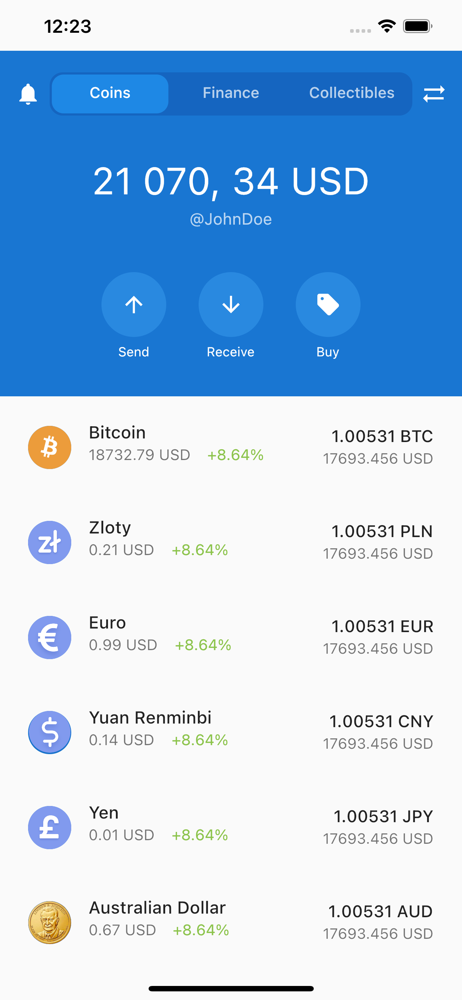

# clone_trust

Please check the below URLs for API documentation

https://docs.coinapi.io/#list-all-assets-get
https://docs.coinapi.io/#list-all-asset-icons-get

# 3rd Packages
    - dio:  Http Client
    - flutter_bloc : for State Managment 
    - get_it :  for Dependecy injection
    - web_socket_channel:  for WebSocket connections
    - cached_network_image :  Caching network images

# Images

   <table>
        <tr>
            <td style="text-align: center">
                    
            </td>            
        </tr>
    </table>

